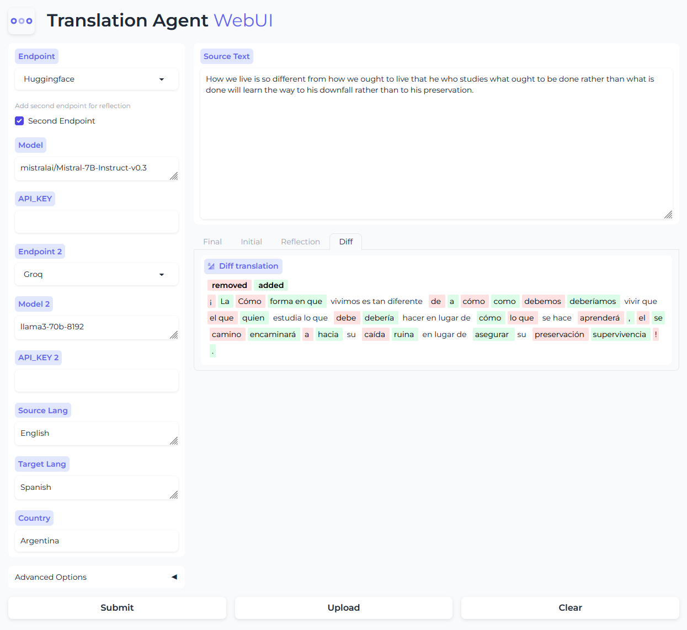

## Translation Agent WebUI

This repository contains a Gradio web UI for a translation agent that utilizes various language models for translation.

### Preview



**Features:**

- **Tokenized Text:**  Displays translated text with tokenization, highlighting differences between original and translated words.
- **Document Upload:** Supports uploading various document formats (PDF, TXT, DOC, etc.) for translation.
- **Multiple API Support:**  Integrates with popular language models like:
    - Groq
    - OpenAI
    - Ollama
    - Together AI
    ...
- **Different LLM for reflection**: Now you can enable second Endpoint to use another LLM for reflection.


**Getting Started**

1. **Install Dependencies:**

    **Linux**
    ```bash
        git clone https://github.com/andrewyng/translation-agent.git
        cd translation-agent
        poetry install --with app
        poetry shell
    ```
    **Windows**
    ```bash
        git clone https://github.com/andrewyng/translation-agent.git
        cd translation-agent
        poetry install --with app
        poetry shell
    ```

2. **Set API Keys:**
   - Rename `.env.sample` to `.env`, you can add your API keys for each service:

     ```
     OPENAI_API_KEY="sk-xxxxx" # Keep this field
     GROQ_API_KEY="xxxxx"
     TOGETHER_API_KEY="xxxxx"
     ```
    - Then you can also set the API_KEY in webui.

3. **Run the Web UI:**

    **Linux**
    ```bash
    python app/app.py
    ```
    **Windows**
    ```bash
    python .\app\app.py
    ```

4. **Access the Web UI:**
   Open your web browser and navigate to `http://127.0.0.1:7860/`.

**Usage:**

1. Select your desired translation API from the Endpoint dropdown menu.
2. Input the source language, target language, and country(optional).
3. Input the source text or upload your document file.
4. Submit and get translation, the UI will display the translated text with tokenization and highlight differences.
5. Enable Second Endpoint, you can add another endpoint by different LLMs for reflection.
6. Using a custom endpoint, you can enter an OpenAI compatible API base url.

**Customization:**

- **Add New LLMs:**  Modify the `patch.py` file to integrate additional LLMs.

**Contributing:**

Contributions are welcome! Feel free to open issues or submit pull requests.

**License:**

This project is licensed under the MIT License.

**DEMO:**

[Huggingface Demo](https://huggingface.co/spaces/vilarin/Translation-Agent-WebUI)
