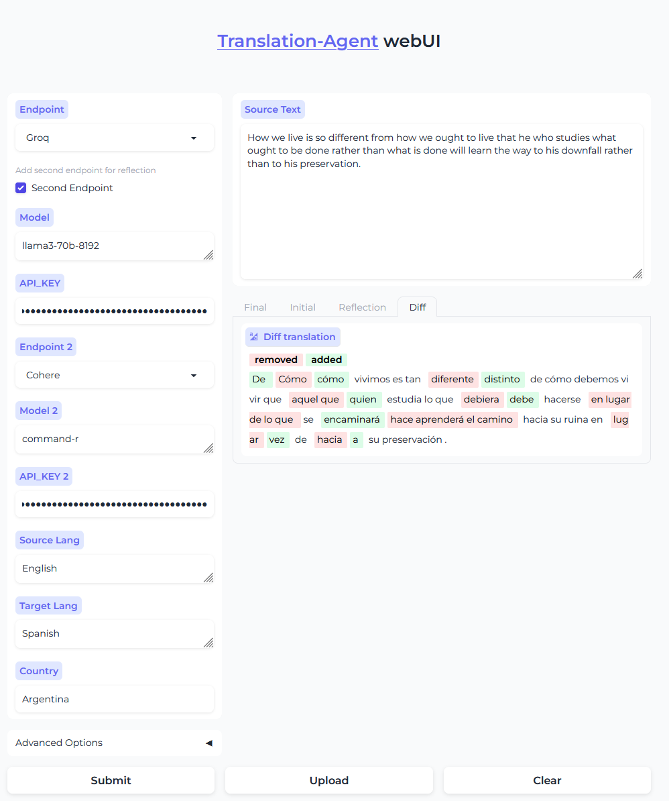

## Translation Agent WebUI

This repository contains a Gradio web UI for a translation agent that utilizes various language models for translation.

### Preview



**Features:**

- **Tokenized Text:**  Displays translated text with tokenization, highlighting differences between original and translated words.
- **Document Upload:** Supports uploading various document formats (PDF, TXT, DOC, etc.) for translation.
- **Multiple API Support:**  Integrates with popular language models like:
    - Groq
    - OpenAI
    - Cohere
    - Ollama
    - Together AI
    - Hugging Face Inference API
    ...
Llama Index supported, easily extendable
- **Different LLM for reflection**: Now you can enable second Endpoint to use another LLM for reflection.


**Getting Started**

1. **Install Dependencies(Using Python Venv):**

    **Linux**
    ```bash
        git clone https://github.com/andrewyng/translation-agent.git
        cd translation-agent
        python -m venv web_ui
        source web_ui/bin/activate
        pip install -r app/webui/requirements.txt

    ```
    **Windows**
    ```bash
        git clone https://github.com/andrewyng/translation-agent.git
        cd translation-agent
        python -m venv web_ui
        .\web_ui\Scripts\activate
        pip install -r app/webui/requirements.txt

    ```

2. **Set API Keys:**
   - Rename `.env.sample` to `.env`, you can add your API keys for each service:

     ```
     OPENAI_API_KEY="sk-xxxxx" # Keep this field
     GROQ_API_KEY="xxxxx"
     COHERE_API_KEY="xxxxx"
     TOGETHER_API_KEY="xxxxx"
     HF_TOKEN="xxxxx"
     ```
    - Then you can also set the API_KEY in webui.

3. **Run the Web UI:**
    ```bash
    python -m app.webui.app
    ```

4. **Access the Web UI:**
   Open your web browser and navigate to `http://127.0.0.1:7860/`.

**Usage:**

1. Select your desired translation API from the Endpoint dropdown menu.
2. Input the source language, target language, and country(optional).
3. If using Hugging Face API, enter your `HF_TOKEN` in the `api_key` textbox, enter `MODEL_ID` or `HF_ENDPOINT_URL` in `Model`  textbox.
4. Input the source text or upload your document file.
5. Submit and get translation, the UI will display the translated text with tokenization and highlight differences.
6. Enable Second Endpoint, you can add another endpoint by different LLMs for reflection.

**Customization:**

- **Add New LLMs:**  Modify the `patch.py` file to integrate additional LLMs.

**Contributing:**

Contributions are welcome! Feel free to open issues or submit pull requests.

**License:**

This project is licensed under the MIT License.

**DEMO:**

[Huggingface Demo](https://huggingface.co/spaces/vilarin/Translation-Agent-WebUI)
